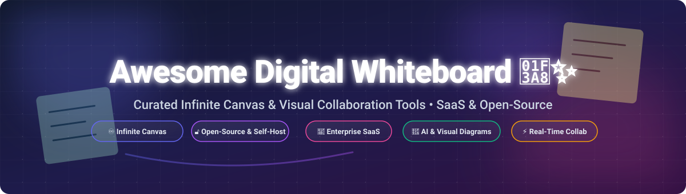

# Awesome Digital Whiteboard 🎨✨

  

  
  
  
  
  
  

**Curated List of SaaS Products & Open-Source GitHub Projects** 🚀

*Focused on Infinite Canvas Collaboration, Real-Time Brainstorming, Agile Workshop Facilitation & Visual Diagramming* 💡

**Last updated: October 2026** 📅

---

## 📌 Overview

This repository tracks top **SaaS platforms** and **open-source projects** for **Digital Whiteboard** applications. These tools help cross-functional teams, product managers, software engineers, and designers brainstorm ideas, build system architecture diagrams, run agile retrospective workshops, and collaborate visually in real time—whether distributed across the globe or in hybrid meeting rooms. 🌐

---

## 📖 Table of Contents

- [💼 SaaS/Hosted Platforms](#-saas-hosted-platforms)
- [🔓 Open-Source GitHub Projects](#-open-source-github-projects)
- [🤝 How to Contribute](#-how-to-contribute)
- [💖 Support](#-support)
- [⭐ Star History](#-star-history)
- [⚠️ Disclaimer](#%EF%B8%8F-disclaimer)

---

## 💼 SaaS/Hosted Platforms

> **📊 Market Context & Size**: The global digital whiteboard software market is estimated at **~$3.2 Billion in 2026** and is projected to expand at a **CAGR of ~14.5%**. The sector is **moderately fragmented**: collaboration giants like **Microsoft** and **Figma (FigJam)** command massive user bases through bundled ecosystem integration, while category specialists like **Miro** ($17.5B valuation) and **Mural** ($2B valuation) hold strong enterprise facilitation dominance. It is not a rigid "winner-take-all" market; buyers regularly choose based on integration ecosystem (Microsoft 365, Figma, Atlassian), compliance requirements, and facilitation workflow needs.

| Platform | Description | Pricing (Starting Tier) | Free Tier Limits | Company Size / Valuation |
|----------|-------------|------------------------|------------------|--------------------------|
| **[Microsoft Whiteboard](https://www.microsoft.com/en-us/microsoft-365/microsoft-whiteboard/digital-whiteboard-app)** 🏢 | Collaborative canvas for Microsoft 365. Ink, sticky notes, shapes, images, and meeting templates. | **$6.00/user/month** (included in Microsoft 365 Business Basic annual commitment) | **Free tier available for any personal Microsoft Account** with unlimited personal boards & basic sharing. | **~$281B Annual Revenue** (Microsoft Corp NASDAQ: MSFT FY2025) |
| **[Miro](https://miro.com/)** 🟡 | Category-defining visual collaboration platform. Infinite canvas, advanced templates, AI tools, and 130+ integrations. | **$8.00/member/month** (billed annually) or **$10.00/member/month** (billed monthly) | **Free Forever**: 3 editable boards, unlimited team members, premade templates, 10 Miro AI credits/month. | **~$17.5B Valuation** (Private, $400M Series C) |
| **[FigJam](https://www.figma.com/figjam/)** 🎨 | Figma's collaborative whiteboard. Seamless design-to-whiteboard integration, widgets, and AI features. | **$3.00/collaborator seat/month** (billed annually) or **$5.00/month** (monthly) | **Starter Free Plan**: 3 active Figma/FigJam files, unlimited drafts, 150 AI credits/day, unlimited collaborators. | **~$12.5B Valuation** (Figma Private Valuation / Tender Offer) |
| **[Lucidspark](https://lucid.co/lucidspark)** ⚡ | Virtual whiteboard from the Lucid Software team. Ideation, dot voting, timer, and seamless Lucidchart sync. | **$7.95/user/month** (Individual Plan billed annually) or **$9.00/user/month** (Team Plan) | **Free Forever Plan**: 3 editable documents, 60 objects per document, 150 free shapes & canvas templates. | **~$3.00B Valuation** (Lucid Software Private Valuation) |
| **[Mural](https://www.mural.co/)** 🧱 | Enterprise visual collaboration built for guided workshop facilitation, agile ceremonies, and team strategy. | **$9.99/member/month** (Team+ Plan billed annually) or **$12.00/member/month** (monthly) | **Free 30-Day Trial** (Unlimited boards & members during trial; no perpetual free tier). | **~$2.00B Valuation** (Mural Private, $50M Series C) |
| **[Explain Everything](https://explaineverything.com/)** 🎓 | Interactive whiteboard and screencasting platform for interactive teaching, video lessons, and visual presentations. | **$3.49/user/month** (Advanced Educator Plan billed annually) or **$6.99/user/month** (Classroom) | **Free Forever Plan**: Up to 3 active projects, 1 uncompressed video export up to 3 minutes, voice recording allowed. | **~$150M Valuation / Acquired** (Acquired by Promethean / NetDragon) |
| **[Bluescape](https://www.bluescape.com/)** 🔒 | High-security visual collaboration platform for defense, government, and media enterprises. On-premise and private cloud available. | **$10.00/user/month** (Pro Tier billed annually) | **30-Day Enterprise Trial** (Full security features, infinite canvas & streaming video; no free forever tier). | **~$100M+ Total Funding Raised** (Private VC Backed) |
| **[Klaxoon](https://klaxoon.com/)** 🇫🇷 | Interactive workshop and meeting platform featuring visual boards, live quizzes, polls, and agile activities. | **$9.00/user/month** (Starter Plan billed annually) or **$14.00/user/month** (monthly) | **Free Forever Plan**: Up to 6 participants per workshop/board, unlimited board creation, basic template library. | **~$50M Total Funding Raised** (Klaxoon Private SAS) |
| **[Stormboard](https://stormboard.com/)** 🌩️ | Digital sticky note whiteboard optimized for structured agile planning, data export, and business process mapping. | **$8.33/user/month** (Personal/Startup Plan billed annually) or **$10.00/user/month** (monthly) | **Free Personal Plan**: 5 active storm boards, up to 5 team members per board, basic sticky note exports. | **Private Business** (Bootstrapped / Private Capital) |
| **[Conceptboard](https://conceptboard.com/)** 🇩🇪 | GDPR-compliant European visual whiteboard for secure team brainstorming and workshop facilitation. | **$6.00/user/month** (Premium Plan billed annually) or **$7.50/user/month** (monthly) | **Free Forever Plan**: 100 objects per board, 100 MB total file storage, unlimited participants, 1 active board. | **Private Business** (Conceptboard GmbH Germany) |

---

## 🔓 Open-Source GitHub Projects

The open-source whiteboard ecosystem is exceptionally mature, offering production-grade infinite canvas engines, self-hostable privacy-first tools, and developer SDKs.

*Projects are sorted by GitHub Stars_Count (Descending).* ⭐️

| Repo | Description | License | Stars_Count |
|------|-------------|---------|------------|
| **[Excalidraw](https://github.com/excalidraw/excalidraw)** ✏️ | Virtual hand-drawn style whiteboard with end-to-end encryption. Features infinite canvas, dark mode, shape libraries, PNG/SVG export, local-first autosave, and Docker self-hosting support. | MIT |  |
| **[AFFiNE](https://github.com/toeverything/AFFiNE)** 📑 | Next-generation all-in-one workspace combining docs, whiteboards, and database tables into a single infinite canvas. | MIT |  |
| **[tldraw](https://github.com/tldraw/tldraw)** 🖌️ | The world's leading infinite canvas SDK for React. Build collaborative whiteboards with multiplayer sync via Cloudflare Durable Objects. | MIT / Commercial |  |
| **[Xournal++](https://github.com/xournalpp/xournalpp)** 📝 | Hand Note-taking software and PDF annotator with stylus / digital pen support for Windows, macOS, and Linux. | GPL-2.0 |  |
| **[Lorien](https://github.com/mbrlabs/Lorien)** 🎨 | Minimalist, cross-platform infinite canvas drawing and note-taking app built with the Godot Engine. | MIT |  |
| **[OpenBoard](https://github.com/OpenBoard-org/OpenBoard)** 🏫 | Cross-platform interactive whiteboard application designed primarily for schools and universities. | GPL-3.0 |  |
| **[WBO (Whitebophir)](https://github.com/lovasoa/whitebophir)** 🌐 | Lightweight, real-time collaborative online whiteboard. Node.js backend with socket.io sync. | AGPL-3.0 |  |
| **[Linwood Butterfly](https://github.com/LinwoodCloud/Butterfly)** 🦋 | Powerful, minimalistic, cross-platform open-source note-taking and whiteboard app with WebDAV sync and stylus support. | MIT |  |
| **[Drawpile](https://github.com/Drawpile/Drawpile)** 🎨 | Free, open-source collaborative drawing program with shared canvas sessions for visual sketching. | GPL-3.0 |  |
| **[Drafft Ink](https://github.com/PatWie/drafft-ink)** 🦀 | High-performance, self-hostable cross-platform digital whiteboard with live collaboration built in Rust & WebGPU. | AGPL-3.0 |  |

---

## 🤝 How to Contribute

Contributions are welcome! Please follow these steps to add or update entries: 🛠️

1. **Fork** this repository.
2. Add your project or SaaS product to `README.md` following the existing markdown table layout.
3. Ensure exact pricing starting tiers, free limits, company sizes, or GitHub Stars_Badges are verified.
4. Open a **Pull Request** with a brief summary of the changes.

---

## 💖 Support

If you find this curated list of digital whiteboards helpful for your team, project, or research, please consider supporting the project:

- ⭐️ **Star** this repository on GitHub to increase its visibility.
- 🔀 **Fork** and share it with fellow developers, designers, and project managers.
- ☕ **Buy me a coffee**: Support ongoing open-source curation and development via the [GitHub Sponsor Dashboard](https://github.com/sponsors/ishandutta2007).

Thank you for being part of the open-source collaboration community! 🙏✨

---

## ⭐ Star History

---

## ⚠️ Disclaimer

- This is a **community-curated list** for informational and educational purposes only.
- Digital whiteboards process strategic data, design assets, and team communication; always review data protection, GDPR, and enterprise compliance policies before deployment.
- Pricing details, free tier quotas, and corporate valuations are accurate based on public web records as of **October 2026** and are subject to change by vendors.
